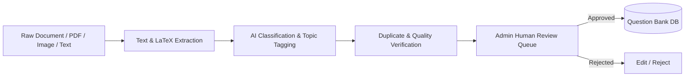
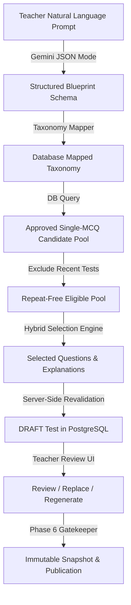

# AI Architecture & Provider Abstraction Specification

## 1. Core Principles of AI Integration

1. **Non-Blocking / Asynchronous Execution**:
   - Examination taking, timer heartbeat, answer persistence, and marks computation operate 100% independently of AI availability.
   - AI is triggered as an asynchronous post-test analysis step or on-demand by admins for question drafting/ingestion.
2. **Deterministic Data Boundary**:
   - The AI receives **strictly calculated numerical statistics** (e.g. `Physics: 18/25 correct, Time: 42m, Accuracy: 72%`).
   - The AI **never** calculates raw scores, percentiles, or answer corrections.
3. **Structured Outputs & Schema Validation**:
   - All LLM responses must strictly adhere to strongly-typed Zod schemas with JSON output enforcement.
   - If output validation fails, a single structured retry is attempted before graceful error degradation.

---

## 2. Provider Abstraction (`AIProvider`)

```typescript
export interface AIProvider {
  /**
   * Translates natural language exam requests into structured test blueprints.
   */
  generateTestSpecification(prompt: string): Promise<TestSpecificationOutput>;

  /**
   * Classifies raw question text/LaTeX into standard taxonomy (subject, chapter, topic, difficulty).
   */
  classifyQuestion(questionContent: string): Promise<QuestionClassificationOutput>;

  /**
   * Verifies question clarity, LaTeX validity, and detects duplicate/suspicious answer keys.
   */
  validateQuestion(questionData: RawQuestionInput): Promise<QuestionValidationOutput>;

  /**
   * Diagnoses error taxonomy on incorrect student answers.
   */
  classifyMistake(input: MistakeDiagnosisInput): Promise<MistakeDiagnosisOutput>;

  /**
   * Generates comprehensive 6-part analytical report from deterministic exam metrics.
   */
  analyzeTestAttempt(data: DeterministicTestResults): Promise<AIReportOutput>;

  /**
   * Recommends personalized follow-up practice tests based on student weak topic history.
   */
  generatePersonalizedRecommendation(history: StudentTopicHistory): Promise<RecommendationOutput>;
}
```

---

## 3. Implemented Adapters
* **Gemini Provider (`GeminiAdapter`)**: Default integration leveraging Gemini Flash / Pro models with `responseSchema` / JSON mode.
* **Mock Provider (`MockAIProvider`)**: Zero-dependency deterministic offline provider for local test suites, CI/CD, and offline development.
* **Extensibility**: Plug-and-play architecture allows OpenAI, Anthropic, or Self-Hosted DeepSeek models by registering new adapter classes.

---

## 4. Question Ingestion & Validation Pipeline



---

## 6. AI Test Paper Generation Architecture



### Invariants:
1. **Non-Hallucination Guarantee**: AI never generates question text, options, answer keys, or marks. Questions are sourced **100% from approved database records**.
2. **Server-Side Revalidation**: Every single question ID is verified against the database before draft creation.
3. **Transparent Shortage Handling**: If eligible candidates are fewer than requested, shortages are explicitly reported with interactive choices (reduce count, expand chapters, widen year range) rather than silently injecting unverified content.
4. **Air-Gapped Exam Runtime**: Created tests are stored as standard `tests` and `test_questions` records. Active test taking, timers, and deterministic scoring operate 100% without AI dependency.

---

## 7. AI Six-Section Diagnostic Test Analysis Architecture (Phase 11)

```mermaid
flowchart TD
    StudentSubmission[Student Exam Submission] -->|Phase 5 Engine| DeterministicScore[Deterministic Scoring & Attempt Answers]
    DeterministicScore -->|Aggregator| DeterministicPayload[Deterministic Analytics Payload<br/>(Factual Numerical Metrics, 0 PII)]
    DeterministicPayload -->|Evidence Threshold Guard| ChapterEvidence[Evidence Classification<br/>(>=3 attempts: Confirmed, <2 attempts: Insufficient Data)]
    ChapterEvidence -->|Cached ai_analysis Check| CacheHit{Existing Valid Report?}
    CacheHit -->|Yes| InstantReturn[Instant Idempotent Delivery]
    CacheHit -->|No| GeminiAdapter[Gemini / Mock AI Provider]
    GeminiAdapter -->|JSON Mode Structured Output| ZodValidation[AIDiagnosticReportSchema Validation]
    ZodValidation -->|Valid| PersistDB[(PostgreSQL ai_analysis<br/>ON DELETE RESTRICT)]
    PersistDB -->|Bundle| StudentUI[6-Section Diagnostic View]
    ZodValidation -->|Failure / Error| ErrorFallback[Deterministic Fallback + Retry Action]
```

### The Six Sections:
1. **Executive Summary**: Strengths summary, weaknesses summary, and overall pedagogical interpretation.
2. **Subject Performance**: Subject scores, max marks, accuracy %, time spent, and relative standing.
3. **Chapter / Topic Weaknesses**: Evidence-based categorization (`STRONG`, `NEEDS_ATTENTION`, `INSUFFICIENT_DATA` for sample sizes $< 2$ questions) with AI diagnostic rationales.
4. **Mistake Analysis**: Question-by-question review of incorrect options, marks lost, time spent, and labeled AI mistake categories (`CONCEPTUAL`, `CALCULATION`, `MISREAD`, `TIME_PRESSURE`).
5. **Time & Attempt Strategy**: Pacing, average time on correct vs incorrect, late-exam stamina analysis.
6. **Targeted AI Improvement Plan**: Prioritized roadmap (Priority 1..n) with concrete practice target question counts (5-50).

### Invariants:
* **Deterministic Facts First**: The AI never calculates scores or changes answer keys. All numbers displayed in the UI are bound to the deterministic payload.
* **Evidence Thresholds**: Sample sizes $< 2$ questions are explicitly tagged as `INSUFFICIENT_DATA` rather than falsely declaring conceptual deficiencies.
* **Student Privacy**: Zero PII (names, emails, IDs) is transmitted to the AI provider.

---

## 8. Persistent Mistake Engine & Error Taxonomy Architecture (Phase 12)

```mermaid
flowchart TD
    AttemptSubmit[Attempt Submission] --> DeterministicScoring[Deterministic Scoring]
    DeterministicScoring --> ExtractIncorrect[Extract Incorrect / Deliberated Answers]
    ExtractIncorrect --> DeterministicRules[Deterministic Rule Classifier]
    DeterministicRules -->|Trigger Match| RuleCandidate[Source: RULE / Status: SUGGESTED]
    DeterministicRules -->|Ambiguous UNKNOWN| AIClassifier[Gemini 3.5 Flash JSON Classification]
    AIClassifier --> AICandidate[Source: AI / Status: SUGGESTED]
    RuleCandidate & AICandidate --> UpsertMistakes[(PostgreSQL mistakes Table<br/>UNIQUE attempt_answer_id)]
    UpsertMistakes --> QuestionHistory[(student_question_history Table)]
    UpsertMistakes --> LongitudinalAggregator[Longitudinal Aggregator]
    LongitudinalAggregator --> TopicMatrix[Topic + Error Taxonomy Matrix]
    LongitudinalAggregator --> RecurringDetector[Recurring Patterns Detector<br/>(Threshold >= 3 across tests)]
    LongitudinalAggregator --> TrendEngine[Deterministic Trend & Resolution Calculator]
    TeacherReview[Teacher / Admin Console] -->|Confirm / Correct| TeacherOverride[Source: TEACHER / Status: CONFIRMED]
    TeacherOverride --> UpsertMistakes
```

### Controlled Error Taxonomy:
1. `CONCEPTUAL_ERROR`
2. `FORMULA_ERROR`
3. `CALCULATION_ERROR`
4. `MISREAD_QUESTION`
5. `WRONG_ASSUMPTION`
6. `TIME_PRESSURE`
7. `CARELESS_ERROR`
8. `GUESS`
9. `UNABLE_TO_START`
10. `UNKNOWN`

### Invariants:
* **Derived Data Only**: Authoritative scores, attempt answers, and test snapshots are immutable.
* **Non-Overwriting Audit Trail**: When a teacher updates a classification, the previous AI/Rule suggestion is preserved in `evidence.audit_history`.
* **Deterministic Trends**: `IMPROVING`, `STABLE`, `WORSENING`, and `INSUFFICIENT_DATA` are calculated mathematically from historical attempt sequences, not hallucinated by AI.

