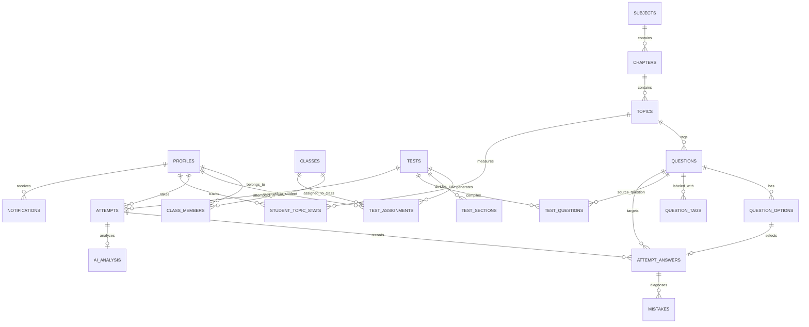

# Database Schema Specification: PostgreSQL & Supabase

## 1. Schema Architecture & Design Philosophy
* **Normalized Relational Design**: Full relational integrity across taxonomy, questions, tests, attempts, answers, mistakes, and analytics.
* **V1 Single MCQ Focus**: V1 exclusively supports Single-Choice MCQs (4 options: A, B, C, D; exactly 1 correct). Schema is designed cleanly to support multi-select or numerical extensions in future phases.
* **Test-Level Marking Configuration**: Tests store their custom marking scheme (e.g., $+4 / -1 / 0$, $+3 / -0.5 / 0$, $+2 / 0 / 0$) in `marking_scheme JSONB`.
* **Immutable Snapshot Strategy**: When a test is published, a frozen snapshot of question text and options is stored in `test_questions.snapshot_data`. Editing the question bank never silently mutates existing published or attempted tests.
* **Authoritative Server Timing**: Attempts store `server_end_time` computed on start, preventing client clock manipulation.
* **Answer Key Protection**: Students cannot view `question_options.is_correct` until the attempt reaches `SUBMITTED`, `AUTO_SUBMITTED`, or `EXPIRED`.
* **Deletion & Cascade Safety**: Questions referenced by tests or attempts use `ON DELETE RESTRICT`. Content retirement uses status flags (`status = 'ARCHIVED'`, `is_active = FALSE`).

---

## 2. Entity-Relationship Diagram (ERD)

---

## 3. Table Catalog & Column Definitions

### 3.1 Organization & Identity
* `profiles` (PK `id UUID -> auth.users`): `email`, `full_name`, `role (enum: 'STUDENT'|'TEACHER'|'ADMIN')`, `target_exam`, `target_year`, `created_at`, `updated_at`.
* `classes` (PK `id UUID`): `name`, `grade`, `academic_year`, `created_by (UUID -> profiles)`, `created_at`, `updated_at`.
* `class_members` (PK `id UUID`): `class_id (UUID -> classes CASCADE)`, `student_id (UUID -> profiles CASCADE)`, `joined_at`, `UNIQUE(class_id, student_id)`.

### 3.2 Academic Taxonomy
* `subjects` (PK `id UUID`): `name TEXT UNIQUE`, `code TEXT UNIQUE`, `created_at`.
* `chapters` (PK `id UUID`): `subject_id (UUID -> subjects CASCADE)`, `name TEXT`, `order_index INT`, `UNIQUE(subject_id, name)`.
* `topics` (PK `id UUID`): `chapter_id (UUID -> chapters CASCADE)`, `name TEXT`, `order_index INT`, `UNIQUE(chapter_id, name)`.

### 3.3 Question Bank (V1 Single MCQ)
* `questions` (PK `id UUID`):
  * `subject_id`, `chapter_id`, `topic_id` (`ON DELETE RESTRICT`)
  * `exam_type ('JEE_MAIN'|'JEE_ADV'|'NEET'|'GENERIC')`
  * `question_type ('SINGLE_MCQ')`
  * `difficulty ('EASY'|'MEDIUM'|'HARD'|'ADVANCED')`
  * `content_latex TEXT`, `explanation_latex TEXT`
  * `source_type ('PYQ'|'INSTITUTE'|'AI_GENERATED'|'SEED_DEMO')`
  * `pyq_year INT`, `pyq_shift TEXT`, `source_reference TEXT`
  * `status ('DRAFT'|'APPROVED'|'ARCHIVED')`, `is_active BOOLEAN`
  * `created_by (UUID -> profiles)`, `created_at`, `updated_at`
* `question_options` (PK `id UUID`):
  * `question_id (UUID -> questions CASCADE)`
  * `option_key ('A'|'B'|'C'|'D')`
  * `content_latex TEXT`
  * `is_correct BOOLEAN` (Authoritative answer key, protected under RLS)
  * `order_index INT`, `UNIQUE(question_id, option_key)`
* `question_tags` (PK `id UUID`): `question_id (UUID -> questions CASCADE)`, `tag_name TEXT`, `UNIQUE(question_id, tag_name)`.

### 3.4 Test Blueprints, Sections & Question Snapshotting
* `tests` (PK `id UUID`):
  * `title TEXT`, `description TEXT`, `instructions TEXT`
  * `exam_type ('JEE_MAIN'|'JEE_ADV'|'NEET')`
  * `test_mode ('SCHEDULED'|'PRACTICE_SELF'|'MOCK')`
  * `duration_minutes INT`, `total_marks INT`
  * `marking_scheme JSONB` (e.g. `{"correct": 4, "incorrect": -1, "unattempted": 0}`)
  * `status ('DRAFT'|'PUBLISHED'|'SCHEDULED'|'LIVE'|'COMPLETED'|'ARCHIVED')`
  * `start_time TIMESTAMPTZ`, `end_time TIMESTAMPTZ`
  * `created_by (UUID -> profiles)`, `published_at TIMESTAMPTZ`, `created_at`, `updated_at`
* `test_sections` (PK `id UUID`): `test_id (UUID -> tests CASCADE)`, `name TEXT`, `order_index INT`, `marking_scheme_override JSONB`.
* `test_questions` (PK `id UUID`):
  * `test_id (UUID -> tests CASCADE)`, `question_id (UUID -> questions RESTRICT)`
  * `section_id (UUID NULL -> test_sections)`, `order_index INT`
  * `marks NUMERIC`, `negative_marks NUMERIC`
  * `snapshot_data JSONB` (Frozen question and options snapshot at publication time)
  * `UNIQUE(test_id, question_id)`
* `test_assignments` (PK `id UUID`):
  * `test_id (UUID -> tests CASCADE)`
  * `class_id (UUID NULL -> classes CASCADE)`, `student_id (UUID NULL -> profiles CASCADE)`
  * `assigned_by (UUID -> profiles)`, `assigned_at`, `due_at`
  * `CHECK (class_id IS NOT NULL OR student_id IS NOT NULL)`

### 3.5 Examination Attempts & Answers
* `attempts` (PK `id UUID`):
  * `test_id (UUID -> tests RESTRICT)`, `student_id (UUID -> profiles CASCADE)`
  * `status ('NOT_STARTED'|'IN_PROGRESS'|'SUBMITTED'|'AUTO_SUBMITTED'|'EXPIRED'|'CANCELLED')`
  * `started_at TIMESTAMPTZ`, `submitted_at TIMESTAMPTZ`
  * `server_end_time TIMESTAMPTZ` (Authoritative server clock cutoff)
  * `time_spent_seconds INT`
  * `total_score NUMERIC`, `accuracy_percentage NUMERIC`, `calculated_stats JSONB`
  * Unique Partial Index: One active `IN_PROGRESS` attempt per `(test_id, student_id)`.
* `attempt_answers` (PK `id UUID`):
  * `attempt_id (UUID -> attempts CASCADE)`, `question_id (UUID -> questions RESTRICT)`
  * `selected_option_id (UUID NULL -> question_options)`
  * `is_marked_for_review BOOLEAN`, `is_visited BOOLEAN`
  * `time_spent_seconds INT`, `is_correct BOOLEAN`, `marks_awarded NUMERIC`
  * `last_saved_at TIMESTAMPTZ`, `UNIQUE(attempt_id, question_id)`

### 3.7 AI Question Ingestion & Staging
* `ingestion_batches` (PK `id UUID`):
  * `title TEXT`, `source_filename TEXT`, `source_file_type ('PDF'|'DOCX'|'TXT'|'CSV'|'IMAGE'|'PASTED_TEXT')`
  * `storage_path TEXT`, `file_size_bytes BIGINT`
  * `total_items INT`, `approved_items INT`, `rejected_items INT`, `pending_items INT`
  * `status ('PENDING'|'PARSING'|'PARSED'|'PROCESSING'|'COMPLETED'|'FAILED')`
  * `metadata JSONB`, `created_by (UUID -> profiles)`, `created_at`, `updated_at`
* `ingestion_items` (PK `id UUID`):
  * `batch_id (UUID -> ingestion_batches CASCADE)`
  * `order_index INT`, `source_page_number INT`, `source_location_ref TEXT`, `raw_content TEXT`
  * `extracted_question_text TEXT`, `extracted_options JSONB`, `extracted_correct_key TEXT`, `extracted_explanation TEXT`
  * `normalized_latex_question TEXT`, `normalized_latex_options JSONB`, `normalized_latex_explanation TEXT`
  * `latex_validation_status ('VALID'|'SYNTAX_ERROR'|'UNCHECKED')`, `latex_validation_error TEXT`
  * `suggested_exam_type`, `suggested_subject_id`, `suggested_chapter_id`, `suggested_topic_id`, `suggested_difficulty`
  * `pyq_year INT`, `pyq_shift TEXT`, `pyq_verified BOOLEAN DEFAULT FALSE`
  * `ai_confidence NUMERIC`, `ai_extraction_metadata JSONB`
  * `duplicate_status ('NEW'|'POSSIBLE_DUPLICATE'|'DUPLICATE')`, `matched_question_id (UUID -> questions RESTRICT)`, `duplicate_similarity_score NUMERIC`
  * `status ('PENDING'|'NEEDS_REVIEW'|'APPROVED'|'REJECTED'|'IMPORTED')`
  * `imported_question_id (UUID -> questions RESTRICT)`
  * `reviewed_by (UUID -> profiles)`, `reviewed_at TIMESTAMPTZ`, `review_notes TEXT`

### 3.8 AI Diagnostic Reports & Analytics (Phase 11)
* `ai_analysis` (PK `id UUID`):
  * `attempt_id (UUID UNIQUE -> attempts RESTRICT)`
  * `user_id (UUID -> profiles RESTRICT)`
  * `test_id (UUID -> tests RESTRICT)`
  * `status ('PENDING'|'COMPLETED'|'FAILED')`
  * `report_version TEXT DEFAULT 'v1.0.0'`
  * `deterministic_payload JSONB NOT NULL` (All factual numbers, metrics, 0 PII)
  * `ai_report JSONB` (Validated 6-section structured output)
  * `error_message TEXT`, `generation_time_ms INT`
  * `created_at TIMESTAMPTZ`, `updated_at TIMESTAMPTZ`, `completed_at TIMESTAMPTZ`

### 3.9 Persistent Mistake Engine & Error Taxonomy (Phase 12)
* `mistakes` (PK `id UUID`):
  * `attempt_answer_id (UUID UNIQUE -> attempt_answers CASCADE)`
  * `student_id (UUID -> profiles CASCADE)`
  * `question_id (UUID -> questions RESTRICT)`
  * `attempt_id (UUID -> attempts RESTRICT)`
  * `test_id (UUID -> tests RESTRICT)`
  * `subject_id (UUID NULL -> subjects SET NULL)`
  * `chapter_id (UUID NULL -> chapters SET NULL)`
  * `topic_id (UUID NULL -> topics SET NULL)`
  * `mistake_type` (Controlled 10-category error taxonomy)
  * `classification_source ('RULE'|'AI'|'TEACHER'|'STUDENT')`
  * `classification_confidence ('HIGH'|'MEDIUM'|'LOW')`
  * `classification_status ('SUGGESTED'|'CONFIRMED'|'REJECTED')`
  * `resolution_status ('OPEN'|'IMPROVING'|'RESOLVED')`
  * `evidence JSONB NOT NULL` (time_spent_seconds, option keys, difficulty, audit_history)
  * `student_feedback TEXT`
  * `reviewed_by (UUID NULL -> profiles SET NULL)`, `reviewed_at TIMESTAMPTZ`, `resolved_at TIMESTAMPTZ`
  * `created_at TIMESTAMPTZ`, `updated_at TIMESTAMPTZ`
* `student_question_history` (PK `id UUID`):
  * `student_id (UUID -> profiles CASCADE)`
  * `question_id (UUID -> questions RESTRICT)`
  * `times_attempted INT DEFAULT 1`, `times_correct INT DEFAULT 0`, `times_incorrect INT DEFAULT 0`
  * `first_attempted_at TIMESTAMPTZ`, `last_attempted_at TIMESTAMPTZ`
  * `last_result ('CORRECT'|'INCORRECT'|'UNATTEMPTED')`
  * `UNIQUE(student_id, question_id)`

---

## 4. Row Level Security (RLS) Policy Matrix

| Table | Anonymous | Authenticated Student | Teacher / Faculty | Admin |
|---|---|---|---|---|
| `profiles` | Denied | Read self, update self (role immutable) | Read student profiles | Full CRUD |
| `classes` & `class_members` | Denied | Read joined classes & rosters | Read/Write assigned classes | Full CRUD |
| `subjects`, `chapters`, `topics` | Denied | Read all | Read all | Full CRUD |
| `questions` | Denied | Read approved active items only | Full CRUD | Full CRUD |
| `question_options` (Answer Key) | Denied | Options text visible; `is_correct` hidden until attempt completed | Full CRUD | Full CRUD |
| `tests` | Denied | Read published tests assigned to student or class | Full CRUD | Full CRUD |
| `test_questions` | Denied | Read for published assigned tests | Full CRUD | Full CRUD |
| `attempts` & `attempt_answers` | Denied | CRUD own records (`student_id = auth.uid()`) | Read class attempts | Full CRUD |
| `ingestion_batches` & `ingestion_items` | Denied | Denied | Full CRUD own batches / Read | Full CRUD |
| `mistakes` & `topic_stats` | Denied | Read own records | Read class analytics | Full CRUD |
| `ai_analysis` | Denied | Read own test report | Read class reports | Full CRUD |

---

## 5. Security Definer Functions
* `public.get_current_user_role()`: STABLE function with `SECURITY DEFINER` returning `profiles.role` for `auth.uid()`. Operates with strict search path to prevent privilege escalation.
