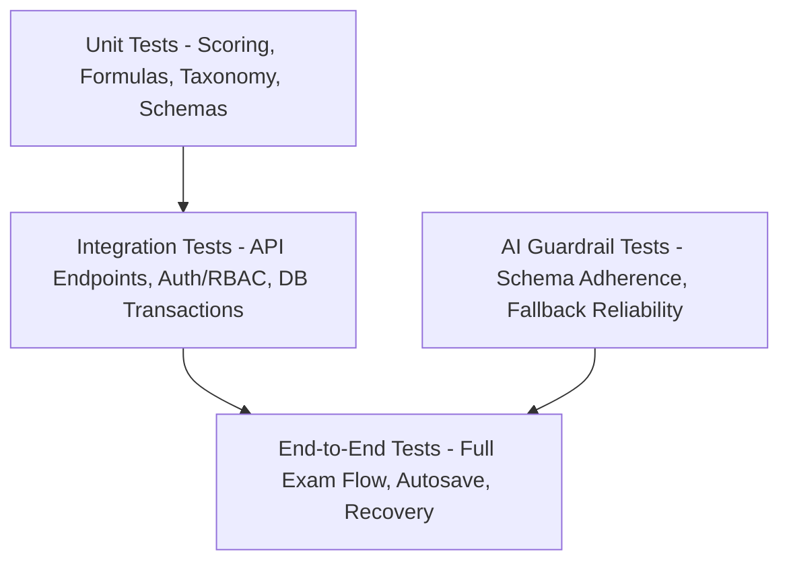

# Testing Strategy & Acceptance Verification

## 1. Multi-Tier Testing Strategy

The test suite ensures total reliability across deterministic exam calculations, security boundaries, and user workflows.

---

## 2. Test Suites & Coverage Focus

### A. Unit Tests (`/tests/unit`)
* **Deterministic Marking Calculator**:
  - Verification of $+4 / -1 / 0$ rule sets.
  - Multi-correct options fractional and penalty scoring.
  - Numerical value precision and tolerance boundaries (e.g., $9.8 \pm 0.05$).
* **Zod Schemas**: Strict rejection of malformed questions, invalid options, and illegal payload overrides.
* **AI Provider Mocking**: Guarantees system resilience when LLM responses return malformed JSON, network timeouts, or invalid schema shapes.

### B. Integration Tests (`/tests/integration`)
* **Authentication & RBAC**:
  - Student attempting to access `/admin/questions` is blocked with 403 Forbidden.
  - Public signup payload cannot inject `role: 'ADMIN'`.
* **Exam Lifecycle**:
  - Start attempt $\rightarrow$ Autosave responses $\rightarrow$ Simulated browser crash $\rightarrow$ Resume with accurate time remaining $\rightarrow$ Server-side submit $\rightarrow$ Compute score.
  - Duplicate submission rejection (idempotency).

### C. End-to-End Workflows (Playwright)
1. **Critical Student Flow**:
   - Login $\rightarrow$ Dashboard $\rightarrow$ Start assigned JEE Mock $\rightarrow$ Attempt 10 questions $\rightarrow$ Mark 2 for review $\rightarrow$ Refresh page $\rightarrow$ Confirm palette states restored $\rightarrow$ Submit test $\rightarrow$ View 6-section report.
2. **Critical Admin Flow**:
   - Admin login $\rightarrow$ Create question with LaTeX formula $\rightarrow$ Generate test paper $\rightarrow$ Assign to Class 12-A $\rightarrow$ Verify test availability.

### F. Student Self-Test Practice Engine Tests (`/tests/practice`)
* **Cross-Subject Balancing**: Tests fair allocation across subjects (e.g. 30 Qs across 3 subjects $\rightarrow$ 10 each, with remainder distributed evenly).
* **PYQ Provenance & Single MCQ Integrity**: Rejects non-APPROVED, non-MCQ, or missing `pyq_year` records.
* **Repeat-Prevention & Uniqueness Priority**: Priority 1 (Never attempted) $\rightarrow$ Priority 2 (Older self-tests) $\rightarrow$ Priority 3 (Previously attempted, only when opted in).
* **Transparent Shortage Reporting**: Rejects silent downgrading and returns clear availability shortage details.
* **Student Isolation RLS & Snapshot Freezing**: Verifies `PRACTICE_SELF` tests are strictly owned by `created_by = auth.uid()` and that modifying source questions does not alter the student's frozen snapshot.

---

## 3. Continuous Integration & Quality Gate
* `npm run lint`: Zero ESLint / TypeScript errors allowed.
### G. AI Question Ingestion & LaTeX Extraction Tests (`/tests/ingestion`, `/tests/ai`)
* **Multi-Format Document Parsing**: Tests CSV column alias mapping (e.g. `Question`, `optA`, `ans`, `level`), free-text page segmenting, and structured question-block regex splitting.
* **KaTeX & LaTeX Normalization**: Converts Unicode symbols ($\tau, \times, \theta, \le, ^{\circ}$) to clean KaTeX macros, cleans delimiter spacing, and catches unclosed braces / syntax errors.
* **Zod Output Validation & Malformed AI Safety**: Strict schema verification on raw AI JSON payloads, testing that corrupted keys, missing options, or non-JSON strings are caught and flagged `NEEDS_REVIEW` without crashing.
* **Multi-Tier Duplicate Detection**: Character-normalized canonical comparison for exact duplicates and token-level Jaccard similarity scoring (threshold $\ge 0.85$ DUPLICATE, $\ge 0.65$ POSSIBLE_DUPLICATE).
* **Staging-to-Question Bank Pipeline**: Validates strict human approval requirement (`status = 'APPROVED'`), preventing direct unreviewed insertion into `questions`.
* **Teacher/Admin Staging Security RLS**: Verifies that anonymous and student roles are completely denied access to staging batches and staging items.

### H. AI Test Paper Generator Tests (`/tests/ai`)
* **Blueprint Schema & Taxonomy Validation**: Validates strongly-typed Zod schemas for AI blueprint outputs, exact question count arithmetic ($\sum \text{subject counts} = \text{total}$), real database taxonomy mapping, and unknown subject/chapter error detection.
* **Difficulty Quota Allocation**: Verifies integer quota allocation across difficulty levels (`ADVANCED`, `HARD`, `MEDIUM`, `EASY`) based on percentage distributions.
* **Non-Hallucination & Eligibility Hard Rules**: Enforces that unapproved, inactive, non-MCQ, or malformed questions are rejected, ensuring 100% of final paper questions are sourced from approved database records.
* **Recent Test Repeat-Prevention**: Excludes questions from recent tests via database history.
* **Transparent Shortage Diagnostics**: Asserts that when qualifying questions are fewer than requested, a structured shortage report with actionable choices is returned rather than silently substituting unverified content.
* **Role-Based Access Control**: Rejects unauthenticated, student, or forged requests to generate drafts or replace draft questions.
* **End-to-End Publication Integration**: Tests complete flow from prompt $\rightarrow$ blueprint $\rightarrow$ candidate selection $\rightarrow$ draft creation $\rightarrow$ question replacement $\rightarrow$ Phase 6 publication validation and snapshot freezing.

### I. AI Six-Section Diagnostic Test Analysis Tests (`/tests/analytics`, `/tests/ai`)
* **Evidence Threshold Boundaries**: Enforces minimum data rules ($< 2$ questions $\rightarrow$ `INSUFFICIENT_DATA`, $\ge 3$ questions with $< 50\%$ accuracy $\rightarrow$ `NEEDS_ATTENTION`, $\ge 70\%$ $\rightarrow$ `STRONG`).
* **Deterministic Analytics Invariants**: Verifies 100% accurate arithmetic across scores, subject totals, chapter averages, and timing metrics (avg on correct vs incorrect, late-exam stamina) with zero PII exposure.
* **AIDiagnosticReportSchema Validation**: Validates all 6 structured sections (Executive Summary, Subject Performance, Chapter Weaknesses, Mistake Analysis, Pacing Strategy, Targeted Action Plan), rejecting malformed LLM responses or illegal category enums.
* **Idempotent Caching & Multi-Subject Pipeline**: Tests end-to-end flow from submission to diagnostic aggregation, AI interpretation, idempotent DB caching, and retry recovery.
* **Diagnostic Security & RLS**: Enforces student isolation policies (`user_id = auth.uid()`), teacher/admin supervision scope, and foreign key `ON DELETE RESTRICT` constraints protecting historical examination diagnostics.

### J. Persistent Mistake Engine & Error Taxonomy Tests (`/tests/mistakes`, `/tests/ai`)
* **Controlled Taxonomy Completeness**: Enforces 10-category error taxonomy, rejecting non-whitelisted arbitrary strings.
* **Deterministic Rule Heuristics**: Tests visited unattempted questions ($\ge 45\text{s} \rightarrow \text{UNABLE\_TO\_START}$), sub-10s guesses on hard questions ($\rightarrow \text{GUESS}$), rapid pacing ($\le 20\text{s} \rightarrow \text{TIME\_PRESSURE}$), extended calculation ($\ge 180\text{s} \rightarrow \text{CALCULATION\_ERROR}$), and ambiguous fallback to `UNKNOWN`.
* **Recurring Pattern Thresholds**: Enforces configurable $\ge 3$ occurrence rule across distinct tests for recurring pattern labeling.
* **Deterministic Trend & Resolution State Transitions**: Validates mathematical calculations for `IMPROVING`, `STABLE`, `WORSENING`, and `INSUFFICIENT_DATA` trends as well as `OPEN`, `IMPROVING`, and `RESOLVED` resolution states.
* **Pipeline Deduplication & Audit Trails**: Tests idempotent UPSERT on `mistakes` table preventing duplicate records on re-analysis, and teacher confirmation preserving the full audit trail.
* **Database & RLS Isolation**: Enforces student isolation (`student_id = auth.uid()`), teacher review privileges, and `ON DELETE RESTRICT` constraints.

### K. Teacher & Class Analytics Dashboard Tests (`/tests/teacher`)
* **Deterministic Calculations & Median Logic**: Verifies odd/even array medians, class average scores, accuracy percentages, participation rates, completion percentages, and score range boundaries.
* **Topic Mastery Evidence Thresholds**: Asserts evidence state labeling ($< 2 \rightarrow \text{INSUFFICIENT\_DATA}$, $\ge 3$ & $< 50\% \rightarrow \text{NEEDS\_ATTENTION}$, $\ge 70\% \rightarrow \text{STRONG}$).
* **10-Category Mistake Matrix**: Tests class-wide aggregation of confirmed vs suggested mistake frequencies across subjects and chapters.
* **Student Performance & Trend Calculation**: Tests mathematical accuracy trends ($\ge +5\% \rightarrow \text{IMPROVING}$, $\le -5\% \rightarrow \text{WORSENING}$, otherwise `STABLE`) and `NEEDS_REVIEW` attention triggers.
* **Question Difficulty & Distractor Analysis**: Verifies question accuracy ranking, option choice percentages, and primary misconception distractor trap detection.
* **CSV Export Formatting**: Asserts RFC-compliant CSV generation with escaped strings and proper column headers.
* **Teacher Authorization & RLS**: Verifies class isolation, student isolation, cascade deletion constraints, and role enforcement (`TEACHER` and `ADMIN`).

---

### L. Production Hardening & Security Tests (`/tests/security`)
* **Secret Isolation Audit**: Scans all TypeScript and TSX source files to verify no server-side secrets (`GEMINI_API_KEY`, `SUPABASE_SERVICE_ROLE_KEY`) are exposed with `NEXT_PUBLIC_` prefixes.
* **SECURITY DEFINER & Search Path Hardening**: Validates that all `SECURITY DEFINER` database functions declare explicit search paths (`SET search_path = public`) and revoke `PUBLIC` execute permissions.
* **Role Escalation Prevention**: Verifies that new user signups strictly default to `STUDENT` and user profile update policies prevent role mutation.
* **Layered Rate Limiting & Bounded Payloads**: Tests best-effort in-memory token bucket mechanics and payload size limits for abuse mitigation.
* **Structured Logging & Credential Redaction**: Tests automatic redaction of API keys, passwords, and JWT tokens in server logs.

---

## 3. Continuous Integration & Quality Gate
* `npm run lint`: Zero ESLint / TypeScript errors allowed.
* `npm run test`: All unit, integration, database/RLS, and security tests pass (239 tests across 36 suites).
* `npm run build`: Production Next.js build succeeds with zero type or route errors.

